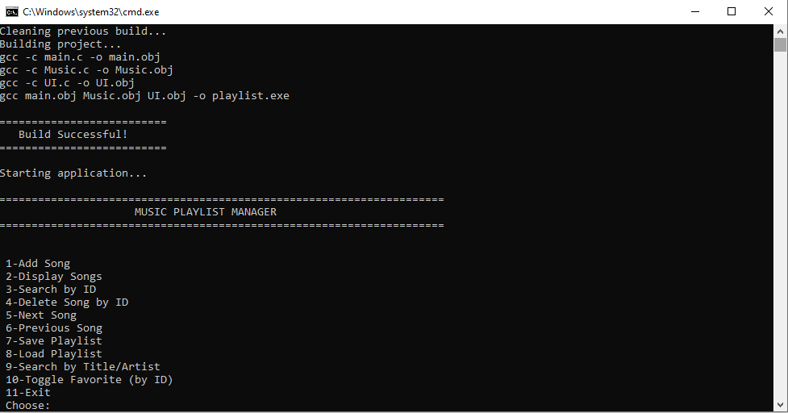
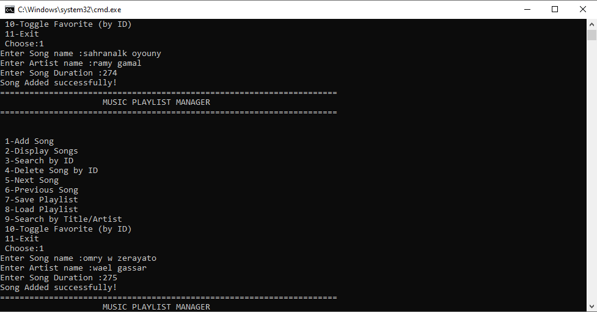
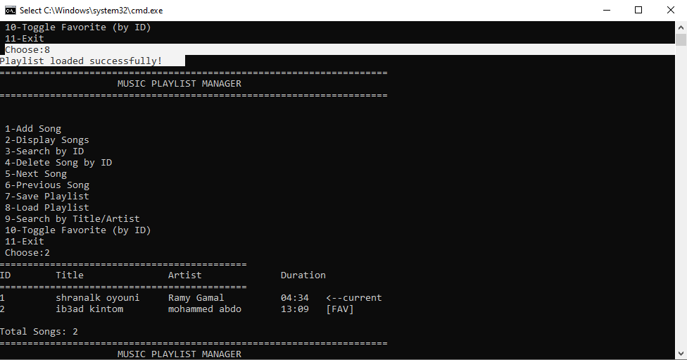
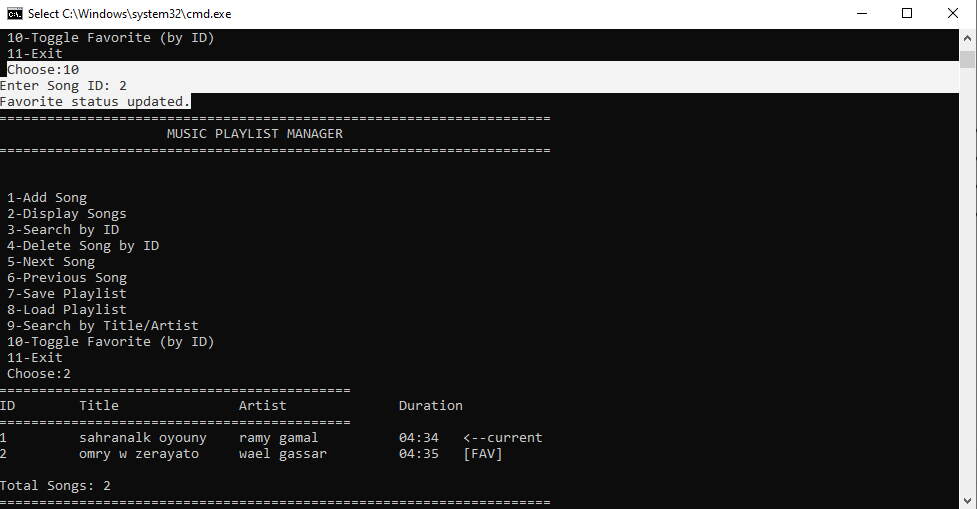

# 🎵 Music Playlist Manager

A modular console-based Music Playlist Manager written in C, designed to demonstrate fundamental data structures, dynamic memory management, modular programming, and file persistence.

The application allows users to create and manage playlists by adding, searching, deleting, navigating, and saving songs while maintaining a clean separation between the User Interface and the core playlist logic.

This project was developed as part of my Embedded Systems learning journey to strengthen my understanding of C programming and software architecture.
## Features

- **Doubly Linked List** — O(1) insertion, bidirectional navigation
- **Song Management** — Add, delete, search by ID or text
- **Navigation** — Next/Previous with & Circular navigation(wrap-around)
- **Favorites** — Toggle favorite status per song
- **Persistent Storage** — Save/load playlist to text file or binary file
- **Input Validation** — Robust error handling and safe input reading
- **Modular Software Architecture**
## 🛠 Technologies Used

- Language: C
- Compiler: GCC
- Data Structure: Doubly Linked List
- Memory Management: malloc() / free()
- File Handling:
  - Text Files
  - Binary Files
- Programming Style:
  - Modular Programming
  - Layer Separation
  - Error Handling
  - Enumerations
## Data Structures

| Structure | Purpose | Complexity |
|-----------|---------|------------|
| `DNode_t` | Doubly linked list node | — |
| `Playlist_t` | Playlist metadata + head/tail/current pointers | — |
| `Song_t` | Song data (title, artist, duration, ID, favorite flag) | — |

| Operation | Time Complexity | Space Complexity |
|-----------|-----------------|------------------|
| Add Song | O(1) | O(1) |
| Delete Song | O(1) | O(1) |
| Search by ID | O(n) | O(1) |
| Search by Text | O(n) | O(k) where k = matches |
| Next/Previous | O(1) | O(1) |

## Project Structure

```
.
├── Music.h          — Core data structures and function declarations
├── Music.c          — Linked list operations, file I/O, search logic
├── UI.h             — UI function declarations
├── UI.c             — Console interface, input handling, display
├── main.c           — Entry point
├── STD_TYPES.h      _ Standard data types
├── playlist.txt     _ Generated text playlist
├── Makefile         — Build automation (Linux/macOS)
├── rebuild.bat        — Build automation (Windows)
└── README.md        — This file
```

## Screenshots

### Main Menu



### Add Song



###Load File &Display Playlist



### Toggle Favorite



## Build & Run
- Clone the repository and build the project using one of the following methods:
### Linux / macOS
```bash
make
./playlist
```

### Windows (CMD)
```cmd
rebuild.bat
```
This script:

- Cleans previous build files
- Rebuilds the project
- Launches the application

### Windows (PowerShell)
```powershell
gcc -o playlist.exe main.c Music.c UI.c
.\playlist.exe
```

### Manual Build
```bash
gcc -o playlist main.c Music.c UI.c -Wall -Wextra -std=c99
```

## Usage

```
=====================================================================
                     MUSIC PLAYLIST MANAGER 
=====================================================================

 1-Add Song
 2-Display Songs 
 3-Search by ID 
 4-Delete Song by ID 
 5-Next Song
 6-Previous Song
 7-Save Playlist
 8-Load Playlist
 9-Search by Title/Artist
 10-Toggle Favorite (by ID)
 11-Exit
 Choose:
```

## File Format (playlist.txt)

```
ID,Title,Artist,Duration(seconds),IsFavorite
```

Example:
```
1,Shape of You,Ed Sheeran,234,1
2,Blinding Lights,The Weeknd,200,0
```
## Binary File Format

Unlike the text format, the binary format stores each field individually instead of writing the entire structure at once.

This approach avoids:

- Structure padding
- Endianness issues
- Compiler-dependent memory layout

## Design Decisions

- **Doubly Linked List over Array** — Efficient insertion/deletion without shifting, natural bidirectional navigation
- **Separate UI Layer** — Business logic (`Music.c`) is independent of presentation (`UI.c`)
- **Status Code Enum** — Consistent error handling across all operations
- **Safe Input Reading** — `ReadUint()` validates numeric input and clears buffer to prevent infinite loops
- **Manual Binary Serialization** — Each field is written individually to ensure compatibility across different compilers and architectures.


## Notes
Binary Save/Load functions are included in Music.c (not exposed in the menu) for the Endianness/Padding handling.

Song IDs are not reused after deletion.

## Design Goals

The project was designed with the following goals:

- Build a reusable playlist library.
- Avoid global variables.
- Demonstrate dynamic memory allocation.
- Practice file persistence using both text and binary formats.
- Improve understanding of pointers and linked lists.

## Memory Management
- Dynamic memory is allocated only when a new song is inserted into the playlist.

- Every allocated node is released using Playlist_Destroy() before program termination or before loading another playlist, preventing memory leaks.

## Error Handling
- The project uses status codes instead of printing errors directly from the playlist library.

- This keeps the playlist module independent from the user interface and allows the caller to decide how errors should be handled.

## Binary File Format

The binary format stores each song field individually instead of writing the entire structure directly.

This design avoids:

- Structure padding
- Compiler-dependent memory layout
- Endianness compatibility issues

Multi-byte integer values are stored in **Big Endian** format to ensure a consistent file representation across different architectures.


## Future Enhancements

- [ ] Sort playlist by title/artist/duration
- [ ] Shuffle/random play mode
- [ ] Multiple playlist support
- [ ] Playlist statistics (total duration, average, etc.)
- [ ] Undo delete functionality (stack-based)

## Author

Osama Shaker — Embedded Software Developer
